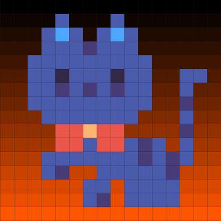
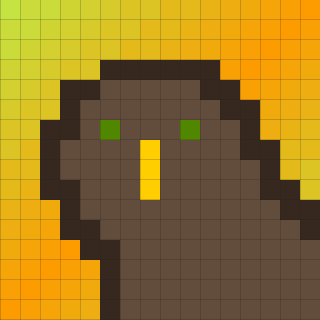
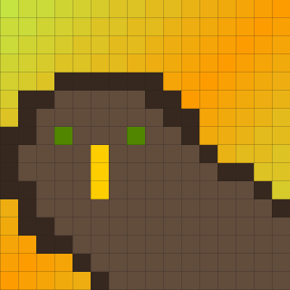
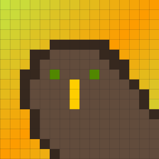
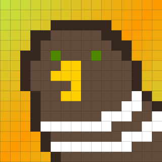
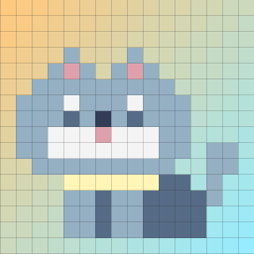

## Welcome to my homepage!

### About me

[My resume](resume.html)

### My Github repositories examples
*[homework 2](https://github.com/wjzhu2022/P8105_HW2_WZ2631)

*[homework 3](https://github.com/wjzhu2022/P8105_HW3_WZ2631)

*[midterm project](https://github.com/wjzhu2022/P8105_MIDTERM_WZ2631)

### I love doing pixel artworks...

### The last thing...
The puppy wanna say hi!

